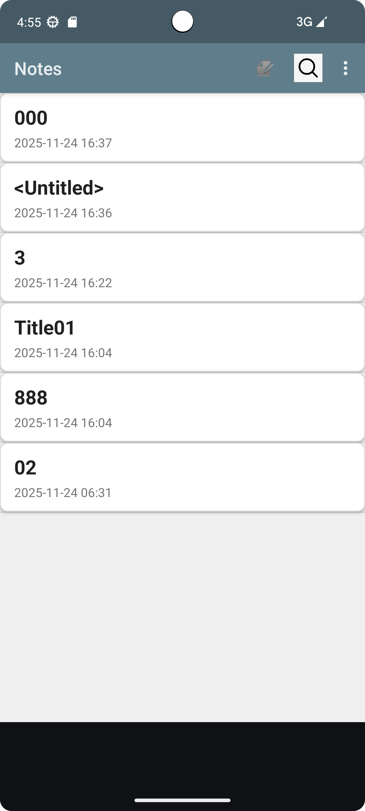
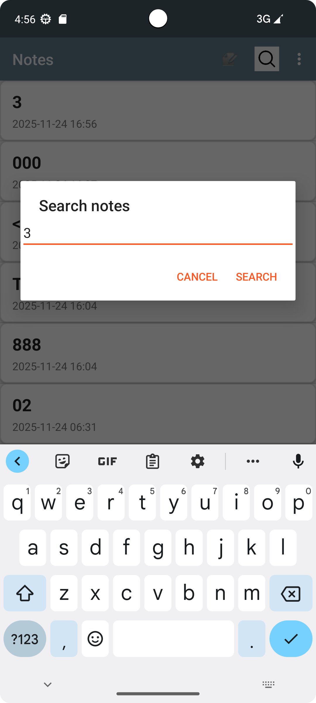
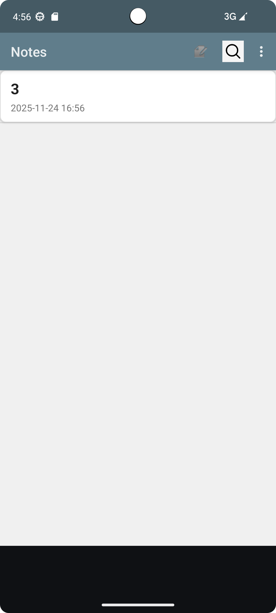
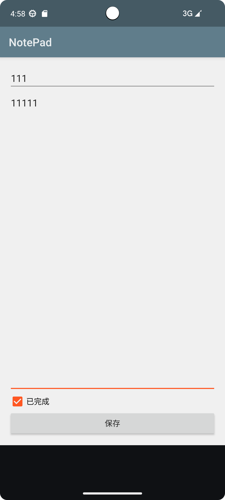
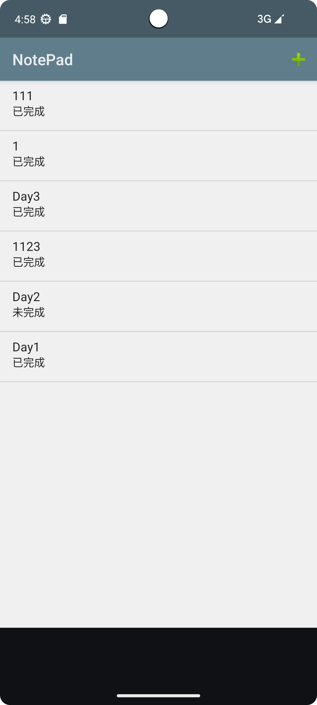

# NotePad 记事本应用

一个基于Android平台的功能增强型记事本应用，在原有基础功能上进行了多项改进和扩展。

## 项目简介

这是一个在Android原生NotePad示例基础上开发的功能增强型记事本应用。通过对原始代码的深入理解和持续改进，实现了多个实用功能，提升了用户体验和功能性。

## 功能演示

    
    
    
    
    
    

## 核心功能

### 基础功能
- 创建、编辑、保存和删除笔记
- 笔记列表展示
- 笔记内容浏览和修改

### 新增功能特性

#### 1. 时间戳显示 ✨
在笔记列表界面中为每个笔记条目添加了创建/修改时间显示，便于用户快速识别笔记的新旧程度。

**实现方式：**
- 在数据库中添加MODIFICATION_DATE字段记录时间
- 使用SimpleDateFormat格式化时间显示
- 在ListView中通过自定义SimpleCursorAdapter展示时间信息

    

#### 2. 笔记查询功能 🔍
支持根据笔记标题或内容进行关键字搜索，帮助用户快速找到所需笔记。

**功能特点：**
- 提供便捷的搜索入口
- 支持标题和内容双重匹配
- 实时过滤和展示搜索结果

    

#### 3. 待办事项管理 📋
集成待办事项功能模块，可以创建和管理个人待办任务列表。

**功能组成：**
- TodoListActivity - 待办事项列表
- TodoEditorActivity - 待办事项编辑器
- 独立的数据库表存储待办事项

    

#### 4. UI界面美化 🎨

##### 主题设定
- 采用Material Design设计语言
- 自定义色彩搭配：主色调为蓝灰色(#607D8B)，强调色为橙红色(#FF5722)
- 统一的应用主题风格，提供舒适的视觉体验

##### 视觉优化
- **笔记列表项**：重新设计为卡片式布局，带有圆角和阴影效果
- **编辑器界面**：优化背景和行线显示，提供更好的写作体验，并添加背景图
- **整体风格**：协调的色彩搭配和现代化的界面元素

    

## 技术实现

### 开发环境
- Android SDK API Level 14+
- Java编程语言
- SQLite数据库存储

## 功能模块说明

### NotesList (笔记列表)
- 展示所有笔记的列表界面
- 支持长按上下文菜单操作（打开、复制、删除）
- 集成搜索功能入口
- 显示笔记标题和时间戳

### NoteEditor (笔记编辑器)
- 笔记内容编辑界面
- 实现带行线的编辑区域
- 支持保存和回退操作

### 搜索功能
- 提供全局笔记搜索能力
- 支持标题和内容双重匹配
- 快速过滤和定位笔记

### 待办事项
- 独立的待办事务管理模块
- 与笔记功能互补，满足多样化需求

## 使用说明

1. 启动应用进入笔记列表界面
2. 点击"+"按钮创建新笔记
3. 点击任意笔记条目可进行编辑
4. 长按笔记条目可执行更多操作（打开、复制、删除、编辑标题）
5. 使用搜索功能快速查找笔记
6. 通过待办事项功能管理个人任务

## 设计亮点

### 用户体验优化
- 直观的操作界面
- 清晰的信息层级
- 流畅的交互反馈

### 视觉设计提升
- 协调的色彩搭配
- 现代化的界面元素
- 舒适的阅读体验

### 功能完整性
- 涵盖笔记管理全生命周期
- 集成搜索和待办扩展功能
- 数据持久化存储保障

## 总结

本项目在保留Android原生NotePad核心功能的基础上，通过四大主要功能增强（时间戳显示、笔记查询、待办事项、UI美化），大大提升了应用的实用性和用户体验。无论是作为学习Android开发的实践项目，还是作为日常使用的记事工具，都具有良好的价值和表现。

