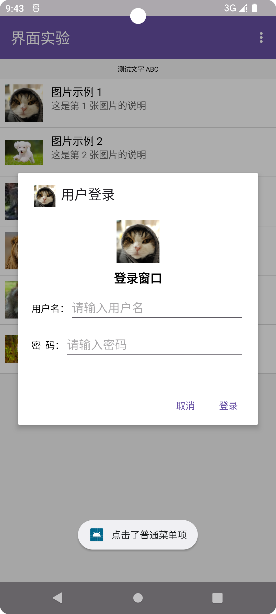

# 实验 3：Android 界面组件实验（Java）

## 一、实验目的
- 掌握 ListView + SimpleAdapter 的使用
- 掌握自定义 AlertDialog
- 掌握菜单(Menu)与 ActionMode 上下文菜单
- 掌握 Notification 通知机制

## 二、开发环境
- Android Studio 2025
- Java 语言
- Min SDK: API 24

## 三、功能截图
（在 screenshots/ 文件夹下放截图）

## 四、功能说明
- 点击 ListView 项：弹出 Toast 并发送通知；
- 长按 ListView 项：进入上下文菜单；
- 通过菜单调整字体大小与颜色；
- 普通菜单项弹出自定义对话框。

## 五、项目结构
app/
├─ java/com/example/sy3_uicomponents/MainActivity.java
├─ res/layout/activity_main.xml
├─ res/layout/list_item.xml
├─ res/layout/dialog_custom.xml
├─ res/menu/menu_main.xml
├─ res/menu/context_menu.xml
├─ res/drawable/ (图片资源)

## 六、作者信息
- 姓名：龙祥
- 学号：121052023123
- 班级：软件工程4班

## 七、实验总结
通过本实验，掌握了 Android 界面编程的基本组件与交互逻辑。
